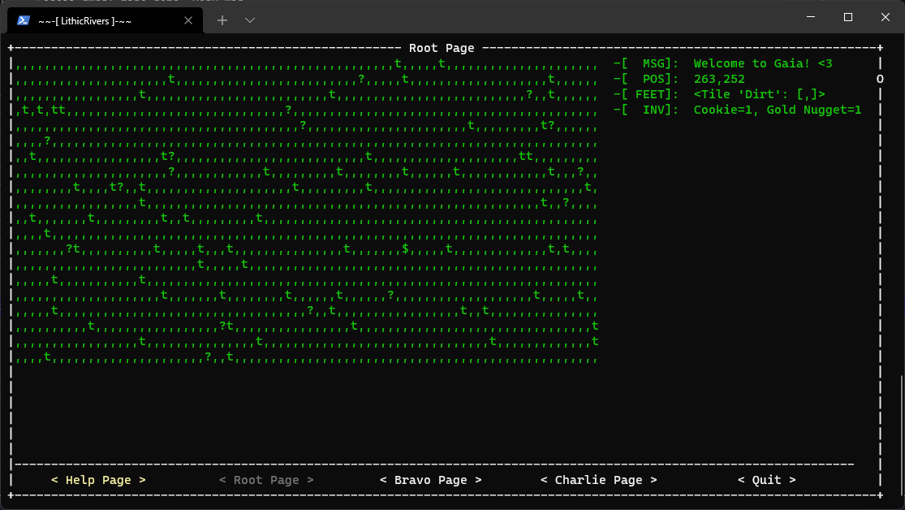
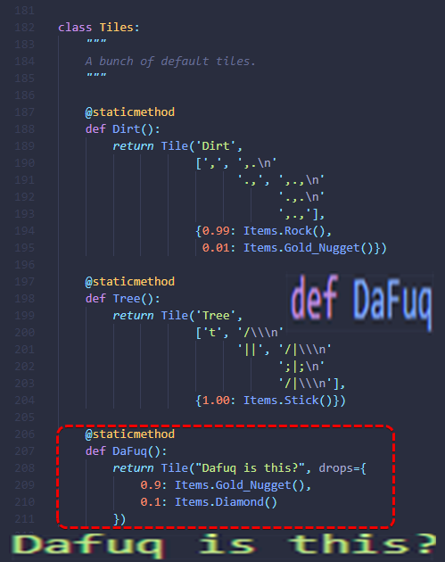

# LithicRivers

An ASCII game in development

## Play the game

Visit <https://replit.com/@HenryFBP/LithicRivers?embed=1> to play this game in an online terminal!

Visit <https://github.com/HenryFBP/LithicRivers/releases> to download a release for your platform.

If you have Docker, run this in bash:
    
    docker run --interactive --tty henryfbp/lithicrivers:latest

to run the game in terminal locally. Please note saved games will be lost.

Currently we support:

- Windows
- OSX 10
- OSX 11
- Debian (built on Ubuntu)

### How to play the game

read the help page

## wow, badges :P

## running

    pipenv install
    pipenv shell
    python -m lithicrivers

## building/release

### Docker

    docker build ./ --tag henryfbp/lithicrivers:latest
    docker push henryfbp/lithicrivers

## notes

- https://github.com/peterbrittain/asciimatics/blob/v1.13/samples/tab_demo.py
- https://stackoverflow.com/questions/9575409/calling-parent-class-init-with-multiple-inheritance-whats-the-right-way/50465583#50465583
- https://github.com/zladovan/gorched

## meme

take a look at some of our reviews below...

god help me
